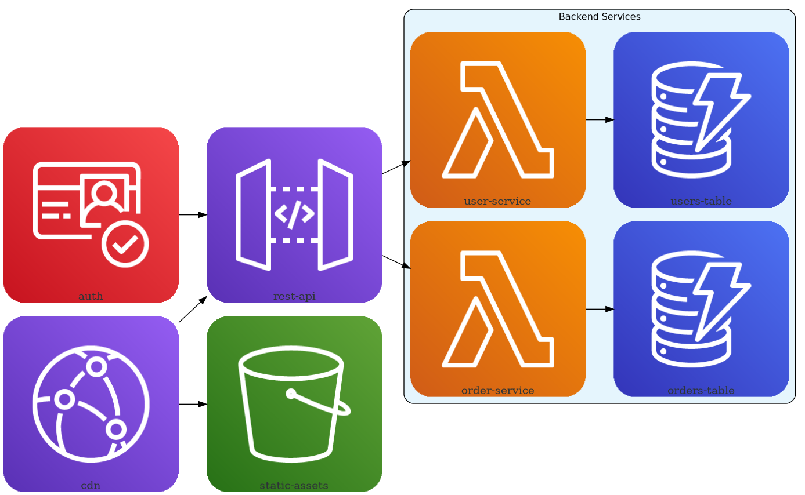
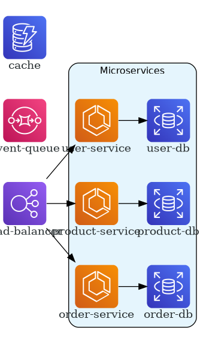
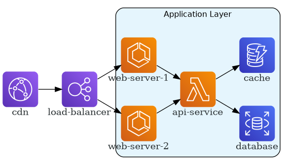
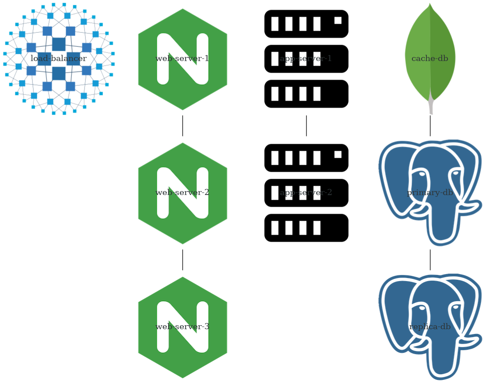

# サンプルギャラリー / Sample Gallery

このディレクトリには、diagrams-tsライブラリを使用したさまざまなアーキテクチャ図の例が含まれています。

This directory contains various architecture diagram examples using the diagrams-ts library.

## カテゴリー / Categories

### AWS (Amazon Web Services)

1. **Serverless Web Application** (`aws/serverless_web_app.ts`)
   - サーバーレスアーキテクチャのWebアプリケーション
   - API Gateway, Lambda, DynamoDB, CloudFront, Cognito を使用

2. **Microservices Architecture** (`aws/microservices_architecture.ts`)
   - マイクロサービスアーキテクチャ
   - ECS, RDS, ElastiCache, SQS, SNS, Route53 を使用

3. **Data Pipeline** (`aws/data_pipeline.ts`)
   - データパイプラインアーキテクチャ
   - Kinesis, Lambda, S3, Athena, QuickSight, Glue を使用

4. **ML Training Pipeline** (`aws/ml_pipeline.ts`)
   - 機械学習トレーニングパイプライン
   - SageMaker, Lambda, S3, Step Functions, ECR を使用

5. **Containerized Application** (`aws/containerized_app.ts`)
   - コンテナ化されたアプリケーション
   - ECS, ECR, RDS, ELB, S3, SQS, SNS を使用

### Programming (プログラミング)

1. **Web Application Stack** (`programming/web_app_stack.ts`)
   - モダンWebアプリケーションスタック
   - React, Node.js, TypeScript, PostgreSQL, MongoDB, Nginx を使用

2. **API Gateway Pattern** (`programming/api_gateway.ts`)
   - APIゲートウェイパターン
   - Python/FastAPI, Java/Spring, Go, PostgreSQL, MongoDB を使用

3. **Microservices with Message Queue** (`programming/message_queue.ts`)
   - メッセージキューを使用したマイクロサービス
   - Django, Flask, RabbitMQ, Kafka, Python, Go, JavaScript を使用

4. **Event-Driven Architecture** (`programming/event_driven.ts`)
   - イベント駆動アーキテクチャ
   - React, FastAPI, Kafka, PostgreSQL, MongoDB を使用

5. **Full Stack Application** (`programming/full_stack.ts`)
   - フルスタックアプリケーション
   - React, Vue, Django, Python, PostgreSQL, MongoDB, Prometheus, Grafana を使用

### OnPrem (オンプレミス)

1. **Traditional Three-Tier Architecture** (`onprem/three_tier.ts`)
   - 伝統的な3層アーキテクチャ
   - HAProxy, Nginx, Server, PostgreSQL, MongoDB を使用

2. **High Availability Web Service** (`onprem/ha_web_service.ts`)
   - 高可用性Webサービス
   - HAProxy, Nginx, Consul, Server, PostgreSQL, MongoDB, Prometheus, Grafana を使用

3. **Data Analytics Platform** (`onprem/data_analytics.ts`)
   - データ分析プラットフォーム
   - Kafka, Server, Cassandra, PostgreSQL, MongoDB, Grafana を使用

4. **Monitoring Stack** (`onprem/monitoring_stack.ts`)
   - 監視スタック
   - Prometheus, Grafana, Cassandra, PostgreSQL, Server を使用

5. **Message Queue System** (`onprem/message_queue_system.ts`)
   - メッセージキューシステム
   - Kafka, RabbitMQ, Nginx, Server, PostgreSQL, MongoDB を使用

## サンプル画像 / Sample Images

いくつかのサンプル画像が `images/` ディレクトリにあります。

Some sample images are available in the `images/` directory.

### AWS Serverless Web Application


### AWS Microservices Architecture


### Programming Web Application Stack


### On-Premises Three-Tier Architecture


## 使い方 / Usage

各例を実行するには、TypeScriptファイルをコンパイルして実行します：

To run each example, compile and execute the TypeScript file:

```bash
# プロジェクトをビルド / Build the project
npm run build

# TypeScriptをコンパイルして実行 / Compile and run TypeScript
npx tsc examples/gallery/aws/serverless_web_app.ts --outDir /tmp/examples --module commonjs --esModuleInterop --target ES2020 --skipLibCheck
cd /tmp/examples/examples/gallery/aws
node serverless_web_app.js

# DOTファイルをPNGに変換 / Convert DOT file to PNG
dot -Tpng aws_serverless_web_app.dot -o aws_serverless_web_app.png
```

または、既存のサンプルを参考にして、独自のアーキテクチャ図を作成できます。

Or you can create your own architecture diagrams based on these examples.

## ライセンス / License

これらの例は、プロジェクトと同じMITライセンスの下で提供されています。

These examples are provided under the same MIT license as the project.
