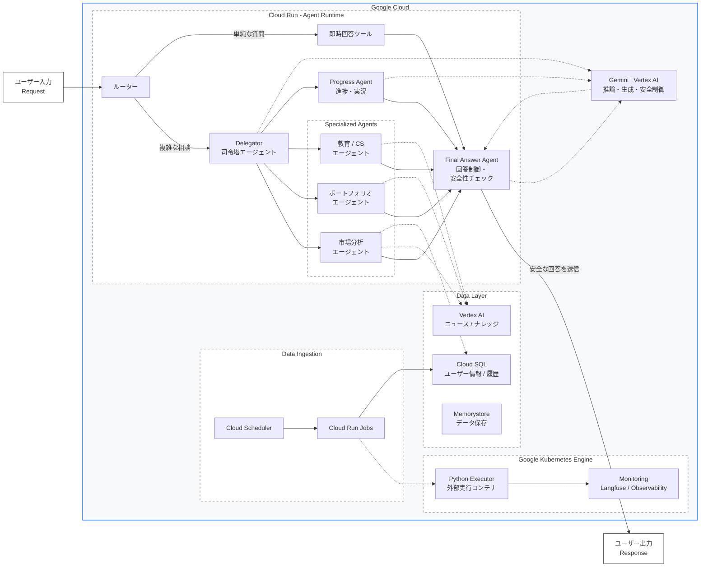

```mermaid
flowchart LR
    %% 外部ノード
    Request["ユーザー入力<br/>Request"]:::plain
    Response["ユーザー出力<br/>Response"]:::plain

    %% Google Cloud クラスター
    subgraph GCP ["Google Cloud"]
        direction LR
        
        %% Data Ingestion
        subgraph DataIngestion ["Data Ingestion"]
            direction TB
            Scheduler["Cloud Scheduler"]
            RunJobs["Cloud Run Jobs"]
        end

        %% GKE
        subgraph GKE ["Google Kubernetes Engine"]
            direction TB
            PythonExec["Python Executor<br/>外部実行コンテナ"]
            Monitoring["Monitoring<br/>Langfuse / Observability"]
        end

        %% Agent Runtime
        subgraph AgentRuntime ["Cloud Run - Agent Runtime"]
            direction TB
            Router["ルーター"]
            Delegator["Delegator<br/>司令塔エージェント"]
            Immediate["即時回答ツール"]
            Progress["Progress Agent<br/>進捗・実況"]
            FinalAnswer["Final Answer Agent<br/>回答制御・<br/>安全性チェック"]
            
            subgraph Specialized ["Specialized Agents"]
                Market["市場分析<br/>エージェント"]
                Portfolio["ポートフォリオ<br/>エージェント"]
                Education["教育 / CS<br/>エージェント"]
            end
        end

        %% Data Layer
        subgraph DataLayer ["Data Layer"]
            direction TB
            SQL["Cloud SQL<br/>ユーザー情報 / 履歴"]
            VertexKnowledge["Vertex AI<br/>ニュース / ナレッジ"]
            Memory["Memorystore<br/>データ保存"]
        end

        %% Gemini
        Gemini["Gemini | Vertex AI<br/>推論・生成・安全制御"]
    end

    %% --- 接続定義 ---

    %% ユーザーフロー
    Request --> Router
    
    %% ルーター分岐
    Router -- "複雑な相談" --> Delegator
    Router -- "単純な質問" --> Immediate

    %% Delegator -> Agents
    Delegator --> Market
    Delegator --> Portfolio
    Delegator --> Education
    Delegator --> Progress

    %% Agents -> Final Answer
    Market --> FinalAnswer
    Portfolio --> FinalAnswer
    Education --> FinalAnswer
    Immediate --> FinalAnswer
    Progress --> FinalAnswer

    %% Final Answer -> Response
    FinalAnswer -- "安全な回答を送信" --> Response

    %% バックグラウンド処理フロー
    Scheduler --> RunJobs
    RunJobs -.-> PythonExec
    RunJobs --> SQL
    PythonExec --> Monitoring

    %% データアクセス・LLM連携 (点線)
    Market -.-> VertexKnowledge
    Portfolio -.-> VertexKnowledge
    Education -.-> VertexKnowledge
    Market -.-> SQL

    FinalAnswer -.-> Gemini
    Gemini -.-> FinalAnswer
    Progress -.-> Gemini
    Delegator -.-> Gemini

    %% スタイル定義
    classDef plain fill:#fff,stroke:#333,stroke-width:1px;
    classDef gcp fill:#F8F9FA,stroke:#4285F4,stroke-width:2px;
    classDef subCluster fill:#fff,stroke:#666,stroke-width:1px,stroke-dasharray: 5 5;
    class GCP gcp
    class DataIngestion,GKE,AgentRuntime,DataLayer,Specialized subCluster
```
